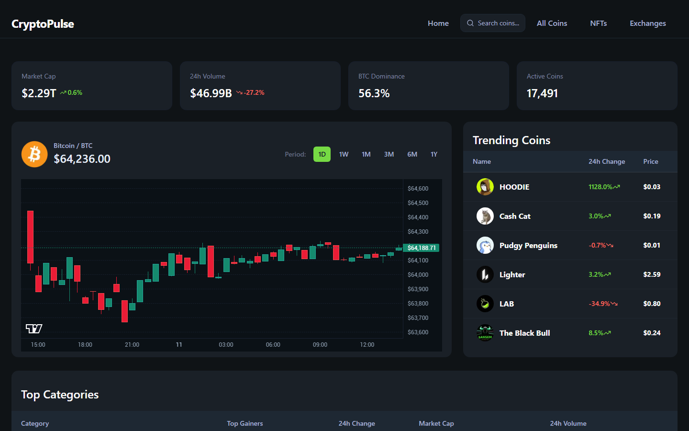
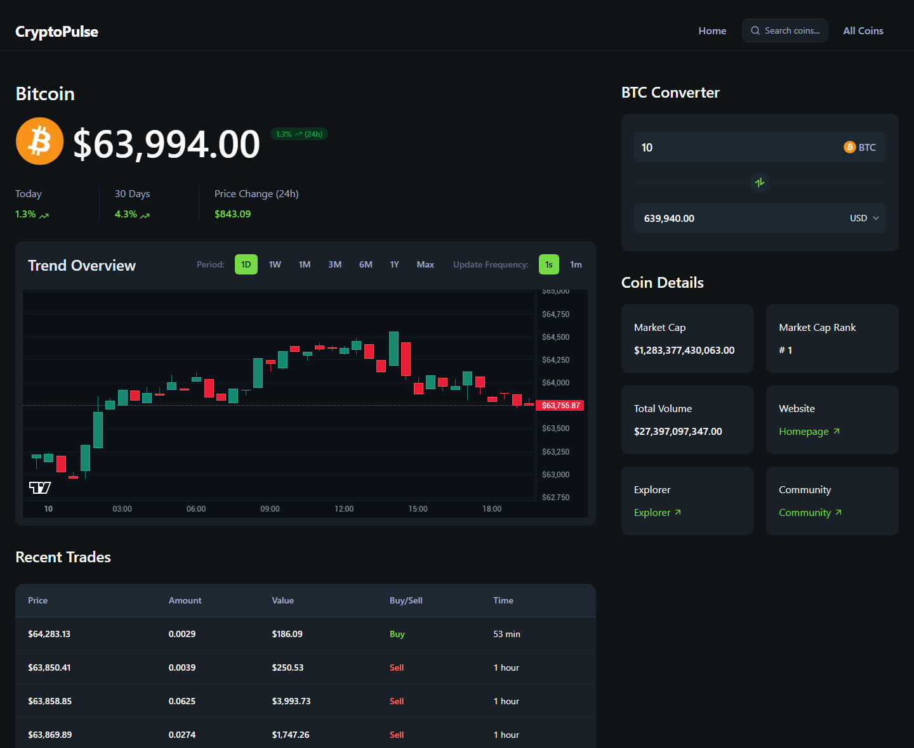
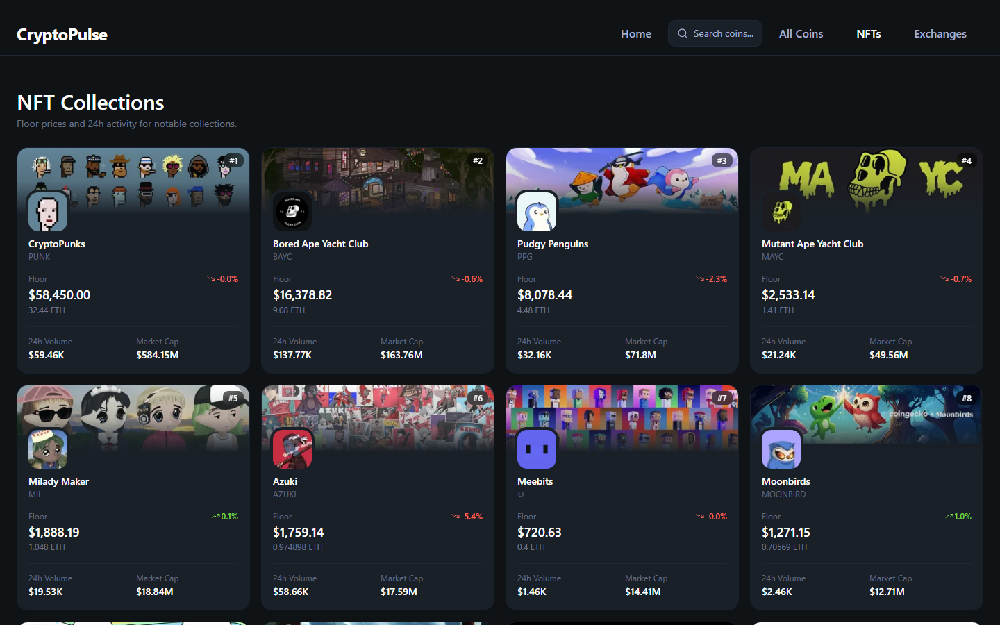
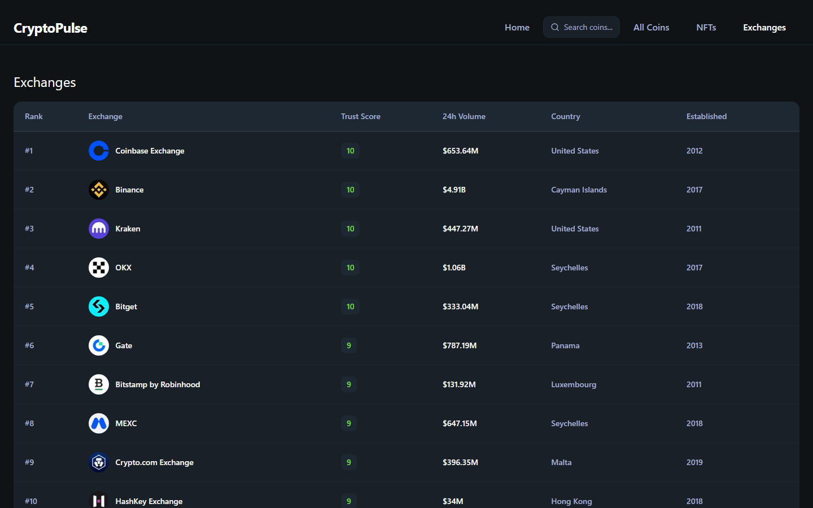
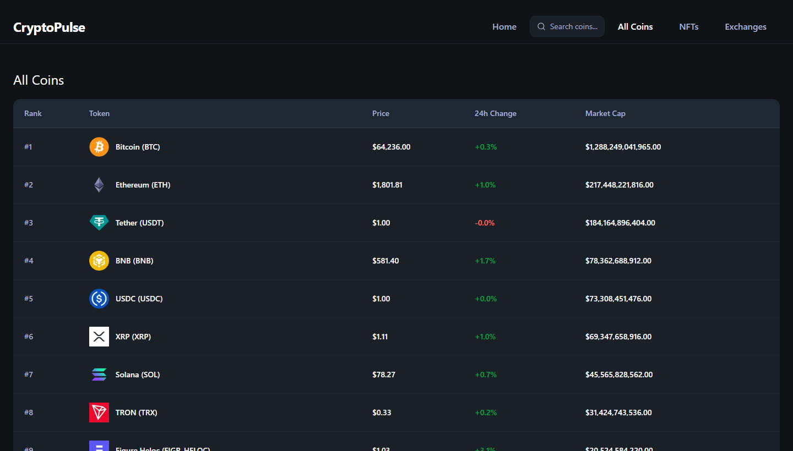

<div align="center">

# ⚡ CryptoPulse

**A real-time cryptocurrency screener & market dashboard, built with Next.js 16 and the CoinGecko API.**


[](https://github.com/Sodiaro/CryptoPulse/actions/workflows/ci.yml)

### [🔗 Live Demo →](https://cryptopulsehq.vercel.app/)



</div>

## About

CryptoPulse is a crypto market dashboard that tracks live prices, trending coins, market categories, NFT collections, exchanges, and per-coin analytics. I built it as a portfolio project to demonstrate production-grade **Next.js App Router** work — streaming server components, Server Actions, third-party API integration on a rate-limited free tier, and a polished, responsive dark UI.

It runs entirely on CoinGecko's free **Demo** plan, with graceful fallbacks so nothing breaks when the API is slow or a data point is missing.

## ✨ Features

- **Home dashboard** — a global market-stats header (total market cap, 24h volume, BTC dominance, active coins), a Bitcoin candlestick overview, live trending coins, and top market categories — each streamed independently with React `Suspense` and skeleton fallbacks.
- **All Coins** — a paginated market table ranked by market cap, with price and 24h change.
- **Coin detail pages** — an interactive candlestick chart with selectable periods (1D → 1Y), a live-updating price header, a currency converter, a market-stats grid (ATH/ATL, 24h high/low, supply, FDV), an About section, official links, and an expandable **Recent Trades** feed sourced from on-chain DEX data.
- **NFT explorer** — a gallery of notable collections with banners, floor prices, and 24h stats, plus a per-collection detail page (floor, market cap, volume, sales, owners, supply).
- **Exchanges** — a ranked, paginated table by trust score & 24h volume, plus a per-exchange detail page with key stats and its top trading pairs.
- **Instant search** — a command-palette-style modal with debounced queries, trending suggestions, full keyboard navigation, and rich result rows.
- **Free-tier resilient** — uses the Demo host/headers, avoids paid-only parameters, and substitutes REST polling where the paid WebSocket feed would normally be used.

## 📸 Screenshots

|             Coin details              |          NFT explorer           |
| :-----------------------------------: | :-----------------------------: |
|  |  |

|              Exchanges               |             All coins              |
| :----------------------------------: | :--------------------------------: |
|      |        |

## 🛠️ Tech Stack

| Area        | Choices                                                                 |
| ----------- | ----------------------------------------------------------------------- |
| Framework   | [Next.js 16](https://nextjs.org) (App Router, Turbopack), React 19      |
| Language    | TypeScript                                                              |
| Styling     | Tailwind CSS v4, [shadcn/ui](https://ui.shadcn.com) + Radix primitives  |
| Charts      | [lightweight-charts](https://github.com/tradingview/lightweight-charts) |
| Data        | [CoinGecko API](https://docs.coingecko.com) via Next.js Server Actions  |
| Icons/Fonts | lucide-react, Geist                                                     |

## 🚀 Getting Started

### Prerequisites

- **Node.js 20+**
- A free **CoinGecko Demo API key** — grab one at [coingecko.com/en/api](https://www.coingecko.com/en/api/pricing).

### Setup

```bash
# 1. Clone
git clone https://github.com/Sodiaro/CryptoPulse.git
cd CryptoPulse

# 2. Install
npm install

# 3. Configure environment (see below)
cp .env.example .env   # then add your key

# 4. Run
npm run dev
```

Open [http://localhost:3000](http://localhost:3000).

### Environment variables

Create a `.env` file in the project root:

```ini
# CoinGecko Demo (free) plan
COINGECKO_BASE_URL=https://api.coingecko.com/api/v3
COINGECKO_API_KEY=your_demo_api_key

# Live WebSocket data requires a paid (Analyst+) plan. Leave false on the free tier.
NEXT_PUBLIC_ENABLE_LIVE_DATA=false

# Only needed when NEXT_PUBLIC_ENABLE_LIVE_DATA=true (both are exposed to the browser)
# NEXT_PUBLIC_COINGECKO_WEBSOCKET_URL=
# NEXT_PUBLIC_COINGECKO_API_KEY=
```

> **Demo vs. Pro:** the free plan uses `api.coingecko.com` with the `x-cg-demo-api-key` header. If you upgrade to a paid plan, switch `COINGECKO_BASE_URL` to `https://pro-api.coingecko.com/api/v3` and the header to `x-cg-pro-api-key` in `lib/coingecko.actions.ts`.

## 🧱 Project Structure

```
app/
  page.tsx              # Home dashboard (streamed sections)
  coins/                # All Coins list + [id] detail pages
  nfts/                 # NFT explorer + [id] collection detail
  exchanges/            # Exchanges list + [id] detail (with trading pairs)
  layout.tsx            # Root layout, header, fonts, metadata
  icon.svg              # Bitcoin favicon
components/
  home/                 # MarketStats, CoinOverview, TrendingCoins, Categories, fallbacks
  Search.tsx            # Search modal
  CandlestickChart.tsx  # lightweight-charts wrapper
  LiveDataWrapper.tsx   # Live header, chart, recent trades
  Converter.tsx         # Currency converter
  DataTable.tsx         # Generic table
  CoinsPagination.tsx   # Path-aware pagination
  NftCard.tsx           # NFT collection card
  ReadMore.tsx          # Clamp/expand for descriptions
  ui/                   # shadcn/ui primitives
hooks/                  # useCoinGeckoWebSocket (live feed, paid tier)
lib/
  coingecko.actions.ts  # Server Actions for all API calls
  utils.ts              # Formatting & helpers
constants.ts            # Chart config, periods, feature flags
type.d.ts               # Shared types
```

## 🧩 Implementation Notes

A few decisions worth calling out:

- **API key stays on the server.** All CoinGecko calls run through Next.js Server Actions, so the key is never shipped to the browser.
- **Streaming SSR.** The home page renders each section behind its own `Suspense` boundary with a skeleton, so the shell paints instantly while data loads.
- **Hydration-safe formatting.** Currency is formatted with a pinned `en-US` locale to avoid server/client mismatches (the server defaulted to `en-GB`, rendering `US$` vs `$`).
- **Free-plan aware.** The paid live WebSocket is gated behind a feature flag; recent trades fall back to polling the on-chain REST endpoint so the feature still works on the Demo tier.

## ▲ Deployment

Live on [Vercel](https://cryptopulsehq.vercel.app/). To deploy your own: import the repo on Vercel, add the two `COINGECKO_*` environment variables, and deploy — it builds with zero extra config.

## 📦 Scripts

| Command         | Description                       |
| --------------- | --------------------------------- |
| `npm run dev`   | Start the dev server (Turbopack)  |
| `npm run build` | Production build                  |
| `npm run start` | Serve the production build        |
| `npm run lint`  | Run ESLint                        |
| `npm run test`  | Run the Vitest unit tests         |

## 📄 License

MIT — free to use, learn from, and build on.

---

<div align="center">
Built by <a href="https://github.com/Sodiaro">Sodiq Semiu</a> · Data by <a href="https://www.coingecko.com/en/api">CoinGecko</a>
</div>
